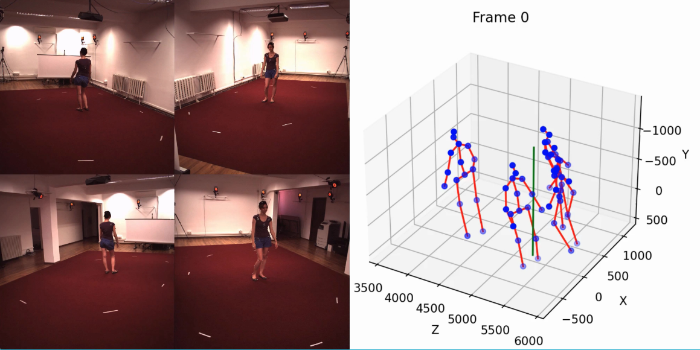
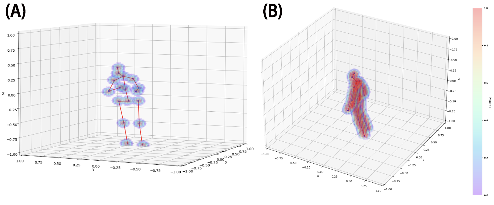

# SoloPose
SoloPose is a novel one-shot, many-to-many spatio-temporal transformer model for kinematic 3D human pose estimation of video.  SoloPose is further fortified by HeatPose, a 3D heatmap based on Gaussian Mixture Model distributions that factor target key points as well as kinematically adjacent key points.
<div align="center">
    
</div>

<div align="center">
    
</div>


# News!
- Dec 2023: [SoloPose](https://github.com/Santa-Clara-Media-Lab/SoloPose) is released!
- Nov 2023: [MoEmo](https://github.com/Santa-Clara-Media-Lab/MoEmo_Vision_Transformer) codes are released!
- Oct 2023: MoEmo was accepted by IROS 2023 (IEEE/RSJ International Conference on Intelligent Robots and Systems).

# install

we need to install the [huggingface](https://huggingface.co/docs/transformers/installation#:~:text=%F0%9F%A4%97%20Transformers%20is%20tested%20on,PyTorch%20installation%20instructions.) to apply the pre-train model. Besides, our network is implemented by Pytorch.


```
conda create -n pose python=3.8
conda activate pose
conda install pytorch torchvision torchaudio pytorch-cuda=11.7 -c pytorch -c nvidia
pip install opencv-python
pip install 'transformers[torch]'
pip install matplotlib
pip install moviepy
pip install chardet
pip install scipy
git clone https://github.com/Santa-Clara-Media-Lab/SoloPose.git
cd Xpose
```
## visuial

- FFmpeg (if you want to export MP4 videos)
- ImageMagick (if you want to export GIFs)

# Pre-trained model
Our pre-trained models will be released after our paper has been accepted.

# Data Prepare
Please ensure you have done everything before you move to the following steps.

In our program, we address data diversity constraints with the 3D AugMotion Toolkit, a methodology to augment existing 3D human pose datasets, specifically by projecting four top public 3D human pose datasets (Humans3.6M, MADS, AIST Dance++, MPI INF 3DHP) into a novel dataset (Humans7.1M) with a universal coordinate system. 3D AugMotion Toolkit is not limited to utilizing these four datasets but also can be applied to other 3D joint datasets.

The 3D AugMotion Toolkit is in `./Dataset/` folder.

1. Download Humans3.6M, MADS, AIST Dance++, MPI INF 3DHP datasets. (we will release the raw data and processed data later.)
2. Find the related .py file, `./Dataset/xxxx_preprocess.py`.
    - Eg. If you want to process the AIST Dance++ dataset, you need to find `ASIT_preprocess.py` in `./Dataset/` folder.
    - The difference between the different `xxxx_preprocess.py` is only the super-parameters for the different datasets, because the format is different between the different datasets. Thus, if you apply our 3D AugMotion Toolkit for another dataset, please change the parameters before you run it.
3. Before running the code, Please change some settings in the code
    - root_path: is the source data path. Please check 'video_folder' and 'video_files' to ensure the sub-dictionary folders and video format are right.
    - output_folder: to save the processed data
    - num_processes: Our code supports multi-cores to speed up the running time. This is the number of cores your PC has. Do not larger than you have.
    - The last two lines codes: Is the place to save the Ground Truth
      ```
      with open(os.path.join(root_path,'/media/imaginarium/2T/dataset/AIST_Dance/annot',"AIST_Dance.pkl"), "wb") as f:
        pickle.dump(GT, f)
      ```
5. Run the `xxxx_preprocess.py` to split the videos into single images and save their Ground Truth.
```
python xxxx_preprocess.py
```
6. Check your output whether is right
    - output_folder: has the folders named as video names, and in these folders, we have saved each frame of video.
    - "AIST_Dance.pkl": The right GT(ground truth) file saving in your path. Here 'AIST' is just an example, please use the different names for the different datasets.
7.  Find the related .py file, `./Dataset/xxxx_merge.py`.
    - This code is to project current data into the universal coordinate system, so that we can merge all datasets in the same format and same coordinate system
    - If you apply our 3D AugMotion Toolkit for other datasets, please also change the parameters before you run it.
    - In our project, our spatial transformer utilizes the Pre-trained CLIP model. We applied CLIP to extract the feature maps of each frame and save these feature maps into tensor files, so that during the training time, we do not need to apply frames as the input, instead we use tensor files as the input, which contains the spatial information.
9.  Before running `./Dataset/xxxx_merge.py`, Please also change some settings in this code
    - root_path: is the output of  `./Dataset/xxxx_preprocess.py`'s output_folder. we will read the frames where you save them by `./Dataset/xxxx_preprocess.py`.
    - output_folder: this code's output path, which is training data
    - GT_path: The path of "AIST_Dance.pkl". Here 'AIST' is just an example, please use the different names for the different datasets.
    - MAX_NUM: the length of the clip video for training. (Here clip is not CLIP)
    - SKIP_NUM: the stride size of sliding windows to clip the videos. (Here clip is not CLIP)
10.  Run the `xxxx_merge.py` to split the videos into single images and save their Ground Truth.
```
python xxxx_merge.py
```
11.  Check your output whether is right
12.  After you run all the codes for all the datasets you want to use, you need to split them into Training datasets, Validation datasets, and Testing data. We will release these datasets after our paper has been accepted.
